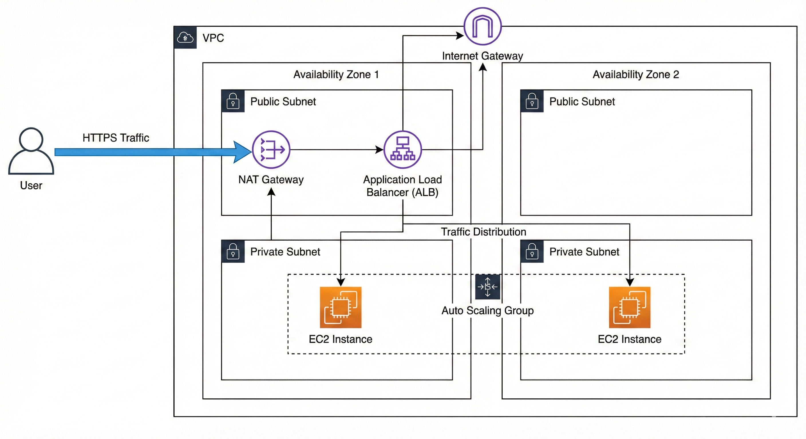

# # Highly Available Web Architecture on AWS

## Project Overview
This project demonstrates how to deploy a fault-tolerant web application on AWS. I separated the architecture into Public and Private subnets to ensure security while maintaining high availability using Auto Scaling Groups.

## Architecture

## Key Features
- **Security:** Web servers run in private subnets; only the Load Balancer is public.
- **Scalability:** Auto Scaling Group monitors CPU usage to add/remove instances.
- **Load Balancing:** An Application Load Balancer distributes incoming traffic.
- **Automation:** User Data scripts automatically install Apache and configure the web page.

## Tools Used
- AWS EC2 & VPC
- Bash Scripting
- Application Load BalancerHighly Available Web Architecture on AWS

